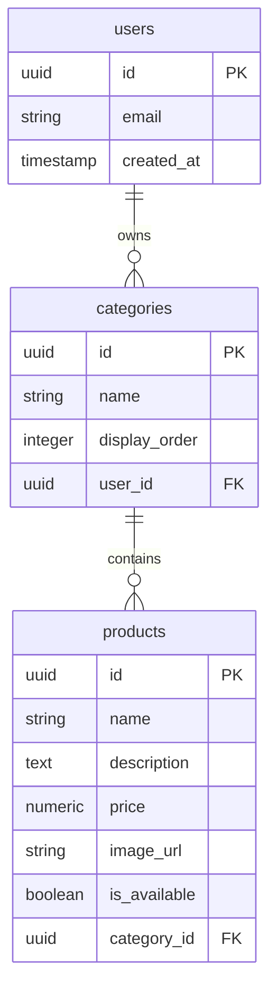
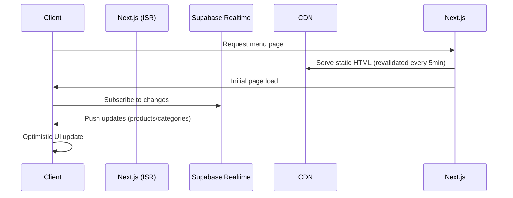
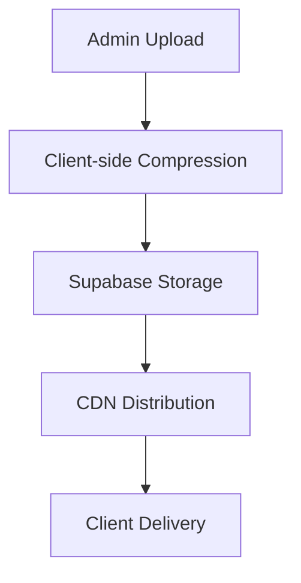

# QR Menu Template Architecture Plan

## 1. Database Schema (Supabase)



**Row-Level Security Policies:**
```sql
-- Products table
CREATE POLICY "Owners can manage products" ON products
FOR ALL USING (auth.uid() = (
  SELECT user_id FROM categories WHERE id = products.category_id
));

-- Categories table
CREATE POLICY "Owners can manage categories" ON categories
FOR ALL USING (auth.uid() = user_id);
```

## 2. File Structure

```
qr-menu-template/
├── app/
│   ├── admin/
│   │   ├── layout.tsx           # Protected admin layout
│   │   ├── page.tsx             # Dashboard with drag-and-drop
│   │   ├── products/
│   │   │   └── [id]/
│   │   │       └── edit.tsx     # In-context product editor
│   │   └── categories/
│   │       └── [id]/
│   │           └── edit.tsx     # Category editor
│   ├── layout.tsx               # Root layout
│   └── page.tsx                 # Customer ISR menu
├── components/
│   ├── ui/                      # shadcn/ui components
│   ├── MenuItem.tsx             # Product display
│   ├── CategorySection.tsx      # Collapsible category
│   ├── ProductForm.tsx          # CRUD form
│   └── ConfirmationModal.tsx    # Delete confirmation
├── lib/
│   └── realtime.ts              # Realtime subscriptions (now takes a Supabase client instance)
├── public/
│   └── images/                  # Placeholder assets
├── .env.local                   # Environment variables
└── .env.example                 # Template with placeholders
```

## 3. Real-time Implementation



**realtime.ts Implementation:**
```typescript
// lib/realtime.ts
import { RealtimePostgresChangesPayload, SupabaseClient, RealtimeChannel } from '@supabase/supabase-js';

export const subscribeToRealtimeUpdates = (supabase: SupabaseClient, table: string, callback: (payload: RealtimePostgresChangesPayload<any>) => void): RealtimeChannel => {
  const channel = supabase.channel(`realtime-${table}`).on('postgres_changes', { event: '*', schema: 'public', table }, callback).subscribe();
  return channel;
};

export const unsubscribeFromRealtimeUpdates = (supabase: SupabaseClient, subscription: RealtimeChannel) => {
  if (subscription) supabase.removeChannel(subscription);
};
```

## 4. Environment Management

**.env.example:**
```ini
NEXT_PUBLIC_SUPABASE_URL=https://your-project.supabase.co
NEXT_PUBLIC_SUPABASE_ANON_KEY=your-anon-key
NEXT_PUBLIC_BUSINESS_NAME="My Restaurant"
```

**Image Optimization Flow:**


## 5. Security Measures

- **Authentication**: `supabase.auth` for admin routes
- **Row-Level Security**: Policies on all database tables
- **Image Uploads**: 
  - Signed URLs with expiration
  - Storage bucket policies restricting uploads to authenticated users

**Admin Protection (app/admin/layout.tsx):**
```tsx
import { redirect } from 'next/navigation';
import { createClient } from '@/lib/supabase/server';

export default async function AdminLayout({ children }) {
  const supabase = createClient();
  const { data } = await supabase.auth.getUser();
  
  if (!data.user) {
    return redirect('/login');
  }
  
  return <>{children}</>;
}
```

## Next Steps:
1. Create implementation tickets for each component
2. Generate Supabase project setup script
3. Develop CI/CD pipeline for deployment